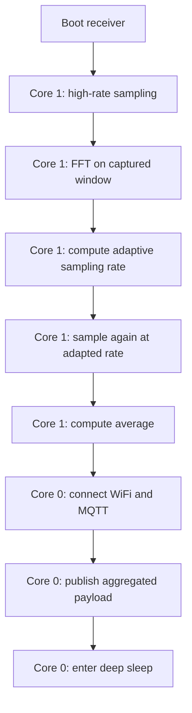

## Report Experiments

### What this document is

This file is the working report of the experiments run in this workspace while building the `final` solution.

The purpose is to keep the measurements separated by experiment, so each block can collect its own current, timing and payload data without mixing different execution contexts.

### Project layout used in the experiments

The workspace is split into three independent pieces, with the receiver built for the Heltec WiFi LoRa 32 V4:

* `final/sender` for signal generation and current measurement
* `final/receiver` for adaptive sampling, FFT and MQTT publication on the Heltec WiFi LoRa 32 V4
* `final/server` for the local Mosquitto broker used by the WiFi tests

Some runs are purely local and some include the radio stack, so the report keeps them separated on purpose.

### Separate experiment data

Use this section as the index for the data blocks collected during the experiments. Each subsection is intentionally independent so you can paste raw logs, averages or screenshots without changing the rest of the report.

#### 1. Max sampling current test

This block is for the analogRead case at maximum frequency, measured as consumption with INA219.

The attached image represents the analogRead run at maximum frequency. The current sits mostly around the mid-60 mA range, with short dips and spikes during the run.

This is the reference point for the analogRead consumption profile when the loop runs as fast as possible.

#### 2. Max sampling current test at 250 Hz

This block is for the analogRead case at 250 Hz, also measured as consumption with INA219.

The attached image represents the analogRead run at 250 Hz. The current sits mostly around the mid-40 mA range, with periodic spikes up to about 55 mA.

The result is lower and more stable than the maximum-frequency analogRead case, which confirms that reducing the sampling rate decreases the consumption in a visible way.

#### 3. Raw read current test

This block is for the raw read case at maximum frequency, also measured as consumption with INA219.

The attached plot for `adc1_get_raw` shows a very similar steady-state profile, with the board holding around the low-60 mA range and a few sharper downward spikes during the run. The important point is that the raw path keeps the consumption stable while the sampling loop stays continuous.

#### 4. Analog read current test with light sleep at 250 Hz

This block is for the analogRead case at 250 Hz with light sleep between samples, also measured as consumption with INA219.

The attached plot shows the expected wake-sleep pattern: the current oscillates between about 6 mA and 60 mA. The low part corresponds to the light-sleep phase, while the peaks correspond to the wake-up, ADC read and immediate return to sleep.

This is the correct result to associate with the analogRead light-sleep experiment. The raw read version at 250 Hz is still pending and should be added only after that test is completed.

#### 5. Max sampling benchmark throughput

This block is for the raw throughput comparison between `analogRead` and `adc1_get_raw`.

| Method | Runs | Total elapsed us | Avg elapsed us | Avg rate Hz | Min rate Hz | Max rate Hz | Last sample |
| :--- | :---: | :---: | :---: | :---: | :---: | :---: | :---: |
| analogRead | 5 | 3001703 | 600340.62 | 16657.21 | 16656.53 | 16658.14 | 3955 |
| adc1_get_raw | 5 | 1212114 | 242422.80 | 41250.25 | 41241.36 | 41254.64 | 3579 |

The result is clear: `adc1_get_raw` is about 2.5x faster than `analogRead` in this benchmark, so it is the better option when the goal is raw ADC throughput.

#### 6. MQTT sender, latency and payload volume tests

The MQTT sender tests were used to measure the end-to-end latency of the message path and the amount of data transmitted over the network.

The sender publishes the aggregated value only, so the payload stays compact. The useful metrics for these runs are:

* latency, measured as round-trip time in microseconds
* payload size, measured in bytes

The observed results are summarised below.

| Case | Payload bytes | RTT us | Main note |
| :--- | :---: | :---: | :--- |
| `mqtt_wifi_receiver / 10k` | 112 | 63153 | local publish with latency probe |
| `mqtt_wifi_receiver / 256` | 109 | 44935 | same path with lower sampling rate |

The payload volume remains very small because only the aggregated value is transmitted, not the full sample stream. The latency changes more than the payload size, so the dominant cost is the network and radio activity rather than the number of bytes carried by MQTT.

#### 7. FFT and averaging tests

The FFT and averaging tests were used to measure how long the FFT stage takes and how much current the board draws while doing the computation.

The target here was not communication, but pure computation:

* capture a fixed number of samples
* run FFT on the window
* compute the average
* measure elapsed time and current draw

The repeated runs show that FFT time and current can vary noticeably between executions, so the report should not present a single number as if it were universal. The measured results are summarised below.

| Case | Target rate | FFT elapsed us | Current A | Main note |
| :--- | :---: | :---: | :---: | :--- |
| `fft_average_sender / 10k` | 10000 Hz | 1894 - 2538 | 0.0267 - 0.0543 | high-rate capture window |
| `fft_average_sender / 256` | 256 Hz | 2283 - 63495 | 0.0332 - 0.0570 | low-rate capture window |

The FFT results were used to estimate the dominant frequency and to decide the next sampling rate in the receiver. For this report, the important point is the execution time of the FFT stage and the current draw expressed directly in amperes.

#### 8. Final receiver flow

The `final/receiver` code combines the previous ideas into one complete sequence on the Heltec WiFi LoRa 32 V4:

1. start with a high-rate sampling phase
2. run FFT on the captured window
3. derive an adaptive sampling rate
4. sample again at the adapted rate
5. compute the average over the window
6. connect WiFi and MQTT only at the end
7. publish the aggregated payload
8. go to deep sleep after the experiment

This structure matters because it keeps the radio off during local processing and postpones network activity until the useful work is done.

The implementation is also split across two cores: the sampling and FFT path runs on core 1, while the WiFi/MQTT publish phase runs on core 0. That separation makes it easier to keep the acquisition side deterministic while the communication side is handled independently on the V4 board.

The plot shows the distinct phases of the integrated run: an initial low-activity region, the sampling and FFT-related step increase, the stable adaptive-sampling plateau, and the final drop when the device finishes the experiment and goes to sleep.

### What changed across experiments

The point of having separate runs was to isolate what each part of the system costs.

* Sampling frequency alone does not explain current draw.
* FFT has a measurable cost, but it is still local and bounded.
* WiFi and MQTT are the most visible step when they are turned on.
* Adaptive sampling helps only if the whole execution flow is organized around it.

### Conclusion

This second README is meant to document the experimental path that led to the current `final` implementation. It is intentionally different from the main README: the first one can remain the formal assignment write-up, while this one is the working report of the measurements actually performed in this repository.