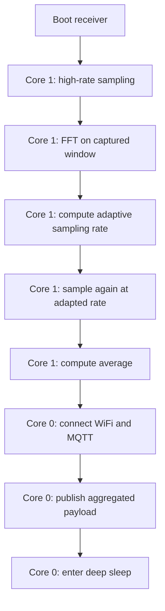

## Report Experiments

### What this document is

This file is the working report of the experiments run in this workspace while building the `final` solution.

The purpose is to keep the measurements separated by experiment, so each block can collect its own current, timing and payload data without mixing different execution contexts.

### Project layout used in the experiments

The final workspace is split into three independent pieces, with the receiver built for the Heltec WiFi LoRa 32 V4:

* `final/sender` for signal generation and current measurement with esp32 V2
* `final/receiver` for adaptive sampling, FFT and MQTT publication on the Heltec WiFi LoRa 32 V4
* `final/server` for the local Mosquitto broker used by the WiFi tests

### Separate experiment data

#### 1. Sampling results

The table below collects the most relevant results for the three sampling experiments requested in this report: maximum sampling, adaptive sampling and sampling with light sleep.

| Case | Mode | Target rate Hz | Main measured result | Current A |
| :--- | :--- | :---: | :--- | :---: |
| Max sampling analogRead | basic / oversampling | max | steady profile around the mid-60 mA range | 0.060 - 0.065 |
| Max sampling adc1_get_raw | basic / oversampling | max | steady profile around the low-60 mA range | 0.060 - 0.065 |
| Adaptive sampling receiver | adaptive | 256 | sample_count=1280, average=2295.2398, capture_us=4999756, payload_bytes=109, rtt_us=44935 | not measured in this block |
| AnalogRead with light sleep | sleep between samples | 250 | wake-sleep pattern with repeated low/high consumption cycles | 0.006 - 0.060 |
| Raw read with light sleep | sleep between samples | 250 | same wake-sleep consumption profile as the analogRead undersampling case | 0.006 - 0.060 |

The maximum-sampling rows describe the board while it keeps sampling continuously. The adaptive row collects the key metrics from the adapted receiver path, including the transmitted payload size and end-to-end latency. The sleep rows show the current oscillation caused by the repeated wake-up cycle, and the raw undersampling case follows the same consumption profile as the analogRead light-sleep experiment.

#### 2. Max sampling benchmark throughput

This block is for the raw throughput comparison between `analogRead` and `adc1_get_raw`.

| Method | Runs | Total elapsed us | Avg elapsed us | Avg rate Hz | Min rate Hz | Max rate Hz | Last sample |
| :--- | :---: | :---: | :---: | :---: | :---: | :---: | :---: |
| analogRead | 5 | 3001703 | 600340.62 | 16657.21 | 16656.53 | 16658.14 | 3955 |
| adc1_get_raw | 5 | 1212114 | 242422.80 | 41250.25 | 41241.36 | 41254.64 | 3579 |

The result is clear: `adc1_get_raw` is about 2.5x faster than `analogRead` in this benchmark, so it is the better option when the goal is raw ADC throughput.

#### 3. MQTT sender, latency and payload volume tests

The MQTT sender tests were used to measure the end-to-end latency of the message path and the amount of data transmitted over the network.

The sender publishes the aggregated value only, so the payload stays compact. The useful metrics for these runs are:

* latency, measured as round-trip time in microseconds
* payload size, measured in bytes

The observed results are summarised below.

| Case | Payload bytes | RTT us | Main note |
| :--- | :---: | :---: | :--- |
| `mqtt_wifi_receiver / 10k` | 112 | 63153 | local publish with latency probe |
| `mqtt_wifi_receiver / 256` | 109 | 44935 | same path with lower sampling rate |

The payload volume remains very small because only the aggregated value is transmitted, not the full sample stream. The latency changes more than the payload size, so the dominant cost is the network and radio activity rather than the number of bytes carried by MQTT.

#### 4. FFT and averaging tests

The FFT and averaging tests were used to measure how long the FFT stage takes and how much current the board draws while doing the computation.

The target here was not communication, but pure computation:

* capture a fixed number of samples
* run FFT on the window
* compute the average
* measure elapsed time and current draw

The repeated runs show that FFT time and current can vary noticeably between executions, so the report should not present a single number as if it were universal. The measured results are summarised below.

| Case | Target rate | FFT elapsed us | Current A | Main note |
| :--- | :---: | :---: | :---: | :--- |
| `fft_average_sender / 10k` | 10000 Hz | 1894 - 2538 | 0.0267 - 0.0543 | high-rate capture window |
| `fft_average_sender / 256` | 256 Hz | 2283 - 63495 | 0.0332 - 0.0570 | low-rate capture window |

The FFT results were used to estimate the dominant frequency and to decide the next sampling rate in the receiver. For this report, the important point is the execution time of the FFT stage and the current draw expressed directly in amperes.

#### 5. Final receiver flow

The `final/receiver` code combines the previous ideas into one complete sequence on the Heltec WiFi LoRa 32 V4:

1. start with a high-rate sampling phase
2. run FFT on the captured window
3. derive an adaptive sampling rate
4. sample again at the adapted rate
5. compute the average over the window
6. connect WiFi and MQTT only at the end
7. publish the aggregated payload
8. go to deep sleep after the experiment

This structure matters because it keeps the radio off during local processing and postpones network activity until the useful work is done.

The implementation is also split across two cores: the sampling and FFT path runs on core 1, while the WiFi/MQTT publish phase runs on core 0. That separation makes it easier to keep the acquisition side deterministic while the communication side is handled independently on the V4 board.

The plot shows the distinct phases of the integrated run: an initial low-activity region, the sampling and FFT-related step increase, the stable adaptive-sampling plateau, and the final drop when the device finishes the experiment and goes to sleep.

#### 6. LoRa communication test

This section documents the use of LoRa as the communication method for the wide-area part of the system.

The device overview in The Things Stack Sandbox shows the end device configuration used for the LoRaWAN path:

| Field | Value |
| :--- | :--- |
| End device ID | `er-meglio-device` |
| DevEUI | registered in the application |
| Frequency plan | Europe 863-870 MHz |
| LoRaWAN version | 1.0.3 |
| Uplinks at the time of the screenshot | none yet |

The relevant point of this test is not the payload size, but the communication role of LoRa itself. Compared with WiFi/MQTT, LoRa is the longer-range and lower-throughput option, so it is better suited when the device must transmit only a compact aggregated value and keep the radio activity minimal.

### What changed across experiments

The point of having separate runs was to isolate what each part of the system costs.

* Sampling frequency alone does not explain current draw.
* FFT has a measurable cost, but it is still local and bounded.
* WiFi and MQTT are the most visible step when they are turned on.
* Adaptive sampling helps only if the whole execution flow is organized around it.

### Final setup and wiring

#### How to start the final code

The final experiment is started in three steps:

1. Start the local MQTT broker with `cd final/server` and `docker compose up -d`.
2. Flash and monitor the sender board with `cd final/sender` and `pio run -t upload -t monitor`.
3. Flash and monitor the receiver board with `cd final/receiver` and `pio run -t upload -t monitor`.

Before launching the receiver, make sure the WiFi credentials and broker address in `final/receiver/src/secrets.h` match the local network.

#### Hardware connections

The INA219 is wired in series with the V4 power supply line, so that all current 
drawn by the V4 flows through the INA219 shunt and is measured by the V2.

| Signal | From | To | Notes |
| :--- | :--- | :--- | :--- |
| Power path | V2 VIN | INA219 VIN+ | 5V USB from PC enters the measurement path |
| Power path | INA219 VIN- | V4 5V | measured current exits toward the V4 |
| I2C clock | V2 GPIO22 | INA219 SCL | I2C bus for current readings |
| I2C data | V2 GPIO21 | INA219 SDA | I2C bus for current readings |
| INA chip power | V2 3V3 | INA219 VCC | logic supply for the INA219 chip |
| Common ground | V2 GND | INA219 GND | shared ground |
| Common ground | V2 GND | V4 GND | shared ground across all three devices |
| Start pulse | V2 GPIO4 | V4 GPIO5 | V2 signals the start of each experiment |
| Signal line | V2 GPIO25 | V4 GPIO7 | sinusoidal signal generated by V2, sampled by V4 |

The V2 is connected to the PC via USB, which is the sole power source for the 
entire circuit. Current flows from the USB 5V rail through the INA219 shunt to 
the V4, so the INA219 captures the full consumption of the V4. The V2 reads the 
INA219 over I2C and logs the measurements to the serial terminal.

### Bonus project

The `final_bonus` folder contains the bonus implementation started from the final project scaffold.

The receiver benchmark now evaluates three signal profiles and two filters in a deterministic way:

| Signal profile | Description |
| :--- | :--- |
| `clean_sine` | pure sinusoid used as the baseline |
| `noisy_mix` | multi-sine signal with additive noise |
| `noisy_anomaly` | noisy mix with deterministic spike anomalies |

| Filter | Purpose |
| :--- | :--- |
| `zscore` | detect outliers using a global z-score threshold |
| `hampel` | detect outliers using a local median and MAD window |

The benchmark prints, for each profile and filter combination, the dominant frequency before and after filtering, the mean absolute error reduction, the detection metrics, the filter execution time and the adaptive-rate estimate derived from the filtered FFT result.

The sender side uses the same shared signal model and keeps the INA219 current logging so the waveform generation cost can still be observed independently.

To run the bonus project:

1. Flash the sender from `final_bonus/sender`.
2. Flash the receiver from `final_bonus/receiver`.
3. Review the serial output for the experiment table and MQTT summary.